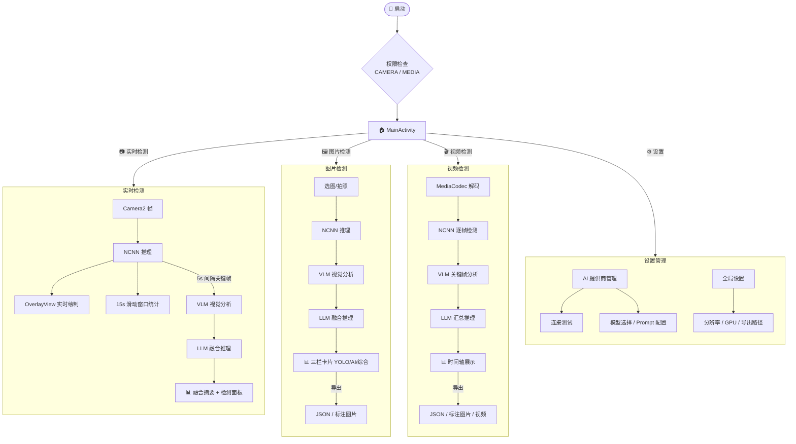
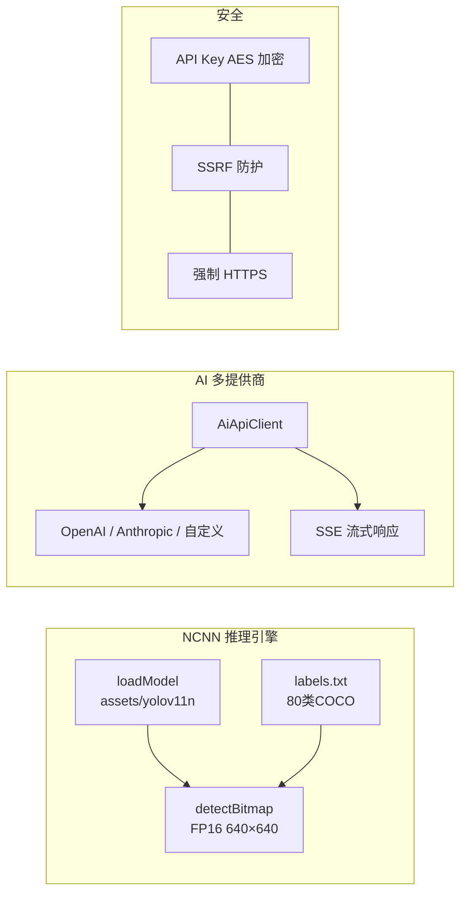

# OpenIris APP 一图流

> v0.4-Alpha · 2026-06-17

```mermaid
flowchart TB
    Start(["🚀 启动"]) --> Perm{"权限检查<br/>CAMERA / MEDIA"}
    Perm --> Main["🏠 MainActivity"]

    Main -->|"📷 实时检测"| RT
    Main -->|"🖼️ 图片检测"| IMG
    Main -->|"🎬 视频检测"| VID
    Main -->|"⚙️ 设置"| SET

    subgraph RT["实时检测"]
        direction TB
        A1["Camera2 帧"] --> A2["NCNN 推理"]
        A2 --> A3["OverlayView 实时绘制"]
        A2 --> A4["15s 滑动窗口统计"]
        A2 -->|"5s 间隔关键帧"| A5["VLM 视觉分析"]
        A5 --> A6["LLM 融合推理"]
        A6 --> A7["📊 融合摘要 + 检测面板"]
    end

    subgraph IMG["图片检测"]
        direction TB
        B1["选图/拍照"] --> B2["NCNN 推理"]
        B2 --> B3["VLM 视觉分析"]
        B3 --> B4["LLM 融合推理"]
        B4 --> B5["📊 三栏卡片 YOLO/AI/综合"]
        B5 -->|"导出"| B6["JSON / 标注图片"]
    end

    subgraph VID["视频检测"]
        direction TB
        C1["MediaCodec 解码"] --> C2["NCNN 逐帧检测"]
        C2 --> C3["VLM 关键帧分析"]
        C3 --> C4["LLM 汇总推理"]
        C4 --> C5["📊 时间轴展示"]
        C5 -->|"导出"| C6["JSON / 标注图片 / 视频"]
    end

    subgraph SET["设置管理"]
        direction TB
        S1["AI 提供商管理"] --> S2["连接测试"]
        S1 --> S3["模型选择 / Prompt 配置"]
        S4["全局设置"] --> S5["分辨率 / GPU / 导出路径"]
    end
```

```mermaid
flowchart LR
    subgraph "NCNN 推理引擎"
        J1["loadModel<br/>assets/yolov11n"] --> J2["detectBitmap<br/>FP16 640×640"]
        J3["labels.txt<br/>80类COCO"] --> J2
    end

    subgraph "AI 多提供商"
        K1["AiApiClient"] --> K2["OpenAI / Anthropic / 自定义"]
        K1 --> K3["SSE 流式响应"]
    end

    subgraph "安全"
        L1["API Key AES 加密"] --- L2["SSRF 防护"]
        L2 --- L3["强制 HTTPS"]
    end
```
