# OpenIris 项目架构流程图

> **版本**: v0.4-Alpha | **更新日期**: 2026-06-16
>
> 本文档以 Mermaid 流程图展示 OpenIris 项目的整体架构、数据流、模块关系与技术能力。

---

## 1. 系统总体架构

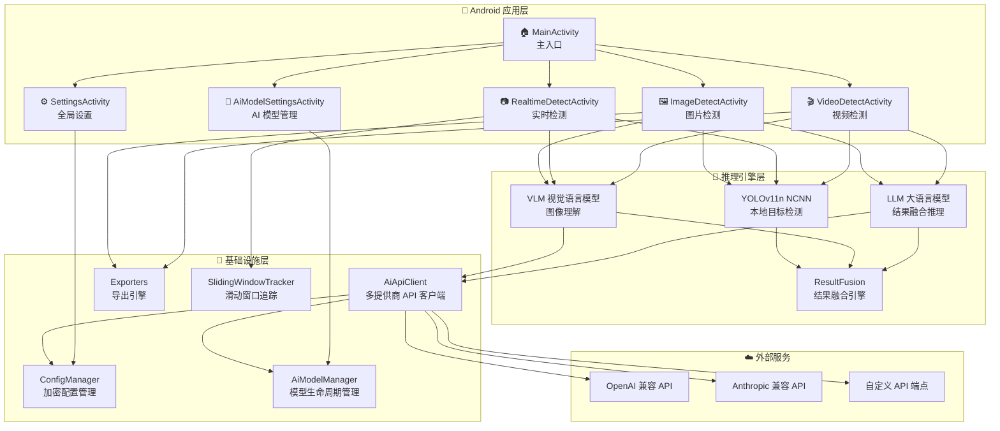

---

## 2. YOLOv11 网络架构详解

> 本节详细展示 YOLOv11 的 Backbone / Neck / Head 结构及各子模块内部数据流，
> 对应项目中 `Yolov11Ncnn.java` 使用的 NCNN 推理模型。

### 2.1 整体网络结构 (Backbone → Neck → Head)

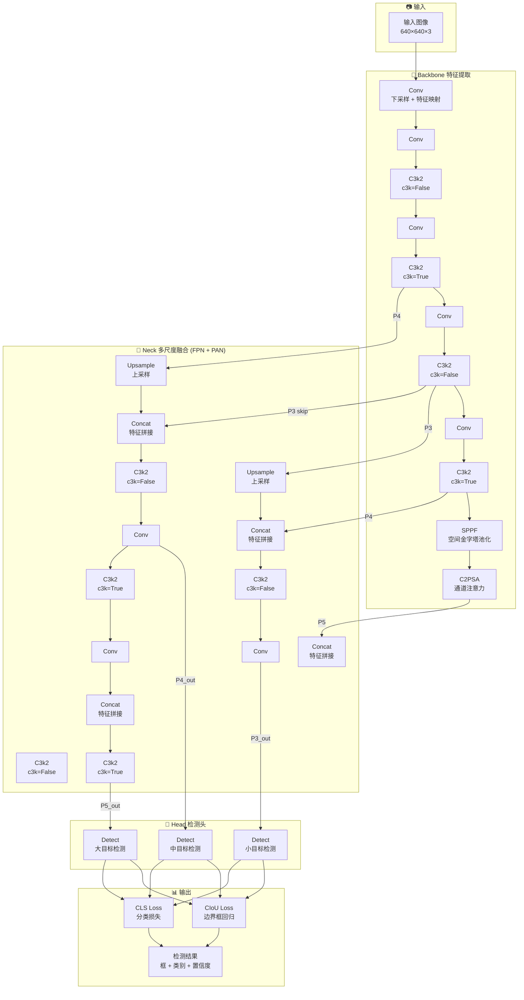

### 2.2 C3k2 模块 (核心构建块)

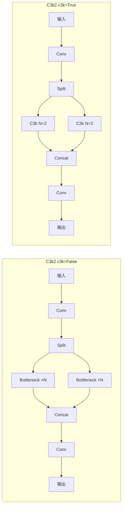

> **差异**: `c3k=False` 使用 `Bottleneck`；`c3k=True` 使用 `C3k(N=2)` 作为子模块。

### 2.3 C3k 模块与 Bottleneck

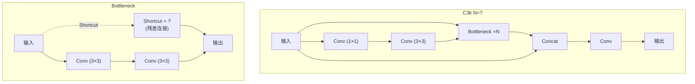

### 2.4 C2PSA 与 PSABlock (通道注意力)

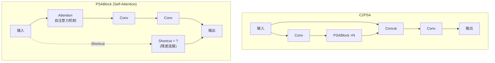

### 2.5 SPPF 空间金字塔池化

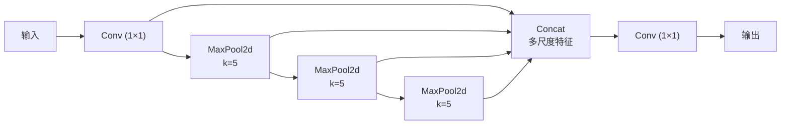

### 2.6 Detect 检测头

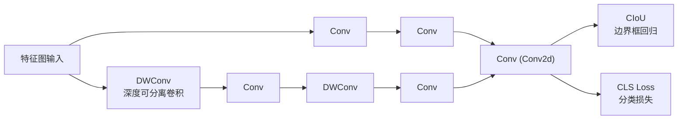

---

### 2.7 模型规格总览

| 参数 | 值 | 说明 |
|------|-----|------|
| **模型** | YOLOv11n (Nano) | 移动端最优轻量模型 |
| **输入尺寸** | 640 × 640 × 3 | RGB 图像 |
| **精度** | FP16 | NCNN 推理引擎 |
| **激活函数** | SiLU | 不可使用 ReLU |
| **输出层** | 3 个 Detect Head | 小/中/大目标 |
| **损失函数** | CIoU + CLSLoss | 边界框 + 分类 |
| **核心模块** | C3k2 / C3k / C2PSA / SPPF | 特征提取与融合 |
| **注意力** | PSABlock (Self-Attention) | C2PSA 内嵌 |
| **输入归一化** | /255, mean=0 | Ultralytics 默认 |
| **ONNX opset** | ≥12 | NCNN 兼容要求 |

---

## 3. 检测模式数据流

### 3.1 实时检测模式

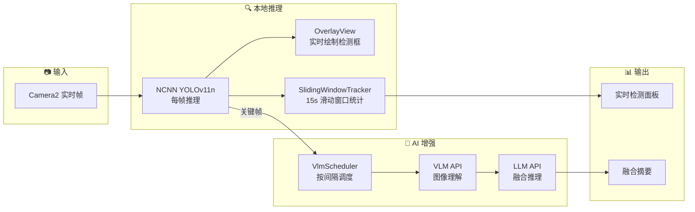

### 3.2 图片检测模式

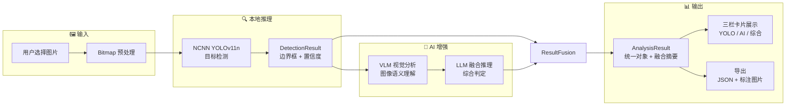

### 3.3 视频检测模式

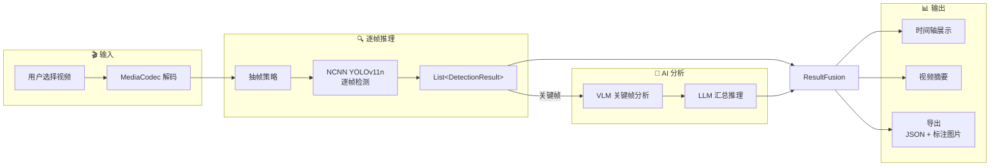

---

## 4. AI 多提供商架构

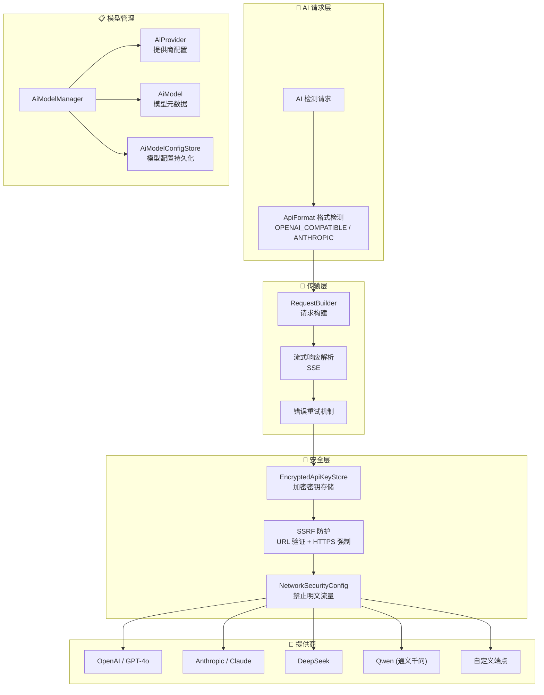

---

## 5. 训练平台工作流

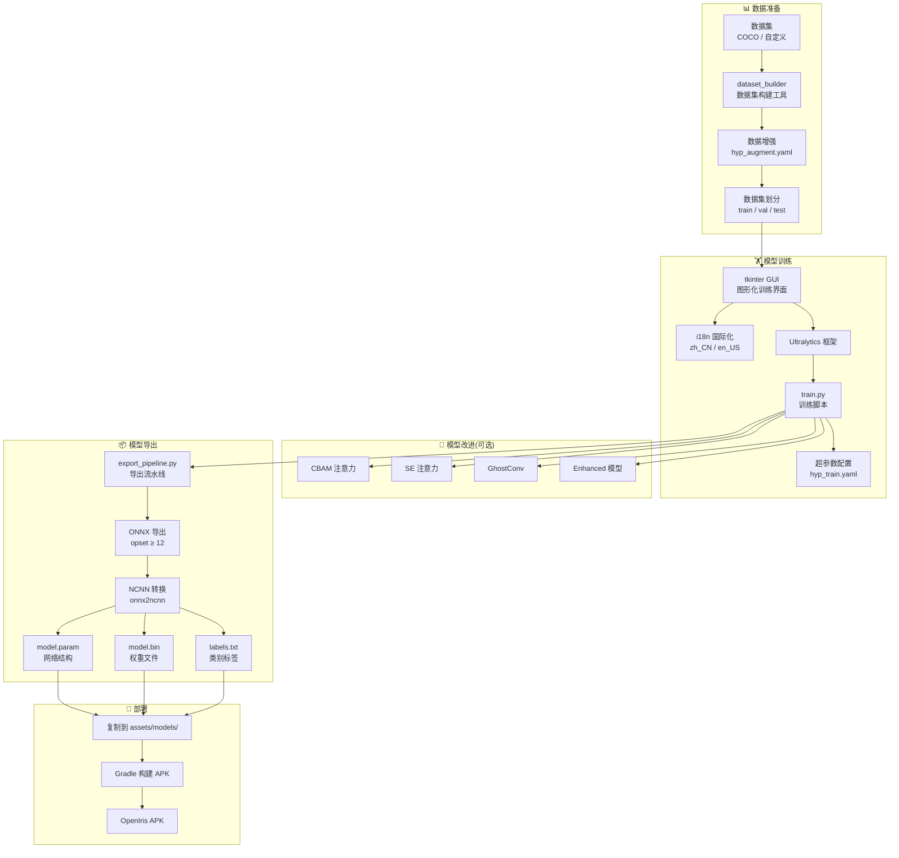

---

## 6. 安全架构

```mermaid
flowchart LR
    subgraph "🔒 安全防护"
        subgraph "数据安全"
            Encrypted["EncryptedSharedPreferences<br/>API Key 加密存储"]
            ApiKeyMask["apiKey 脱敏<br/>日志显示 ***"]
            DebugGate["BuildConfig.DEBUG<br/>敏感日志门控"]
        end

        subgraph "网络安全"
            HTTPS["强制 HTTPS"]
            SSRFCheck["SSRF 防护<br/>阻止内网地址"]
            NetSec["NetworkSecurityConfig<br/>禁止明文流量"]
            NoInterceptor["Release 移除<br/>HttpLoggingInterceptor"]
        end

        subgraph "代码安全"
            ProGuard["ProGuard 收紧<br/>仅保留 Gson 模型类"]
            SafeCall["安全调用<br/>消除 Force Unwrap"]
            Android14["Android 14+ 权限<br/>READ_MEDIA_VISUAL_USER_SELECTED"]
        end
    end

    Encrypted --> ApiKeyMask
    ApiKeyMask --> DebugGate
    HTTPS --> SSRFCheck
    SSRFCheck --> NetSec
    NetSec --> NoInterceptor
    ProGuard --> SafeCall
    SafeCall --> Android14
```

---

## 7. 导出系统

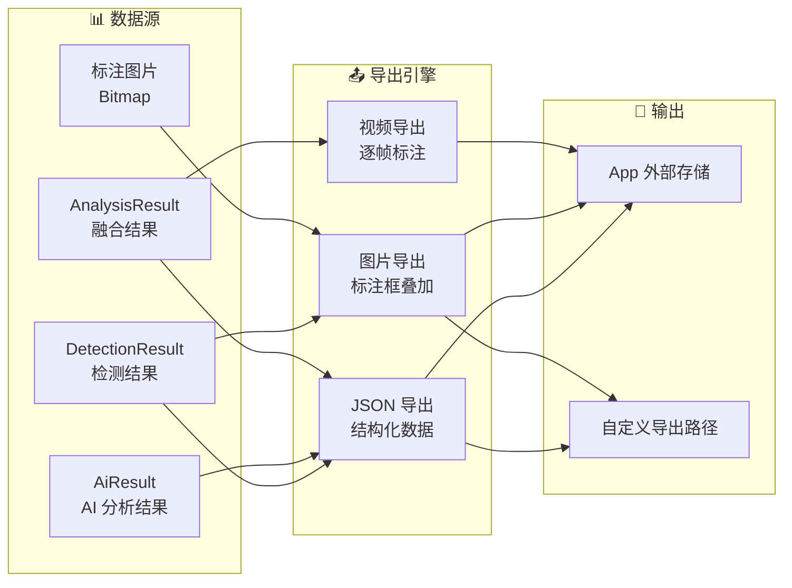

---

## 8. UI 组件架构

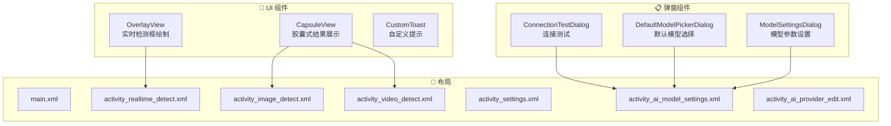

---

## 9. 技术能力矩阵

| 能力域 | 技术组件 | 说明 |
|--------|----------|------|
| **本地推理** | YOLOv11n + NCNN | FP16 精度,640×640 输入,80 类 COCO 目标 |
| **AI 视觉理解** | VLM (OpenAI 兼容 API) | 多供应商支持,流式响应 |
| **AI 语义融合** | LLM (OpenAI 兼容 API) | YOLO + VLM 结果智能融合 |
| **实时检测** | Camera2 + OverlayView | 15s 滑动窗口统计,帧级叠加 |
| **图片分析** | Bitmap + EXIF 处理 | 支持 HEIF/HEIC,高分辨率 |
| **视频分析** | MediaCodec 解码 | 抽帧策略,时间轴展示 |
| **安全存储** | EncryptedSharedPreferences | API Key 加密,SSRF 防护 |
| **多提供商** | AiApiClient | OpenAI + Anthropic 格式兼容 |
| **结果导出** | JSON / 标注图片 / 视频 | 可配置导出路径 |
| **训练平台** | Ultralytics + tkinter GUI | i18n,注意力机制,一键导出部署 |
| **并发安全** | CopyOnWriteArrayList | 竞态条件防护,线程安全 |
| **兼容性** | Android 12+ (API 31) | targetSdk 36,Material Design 3 |

---

## 10. 版本演进

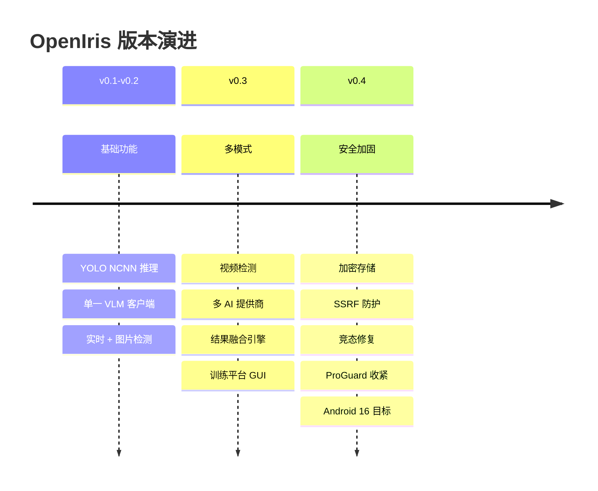

---

## 11. 模块依赖关系

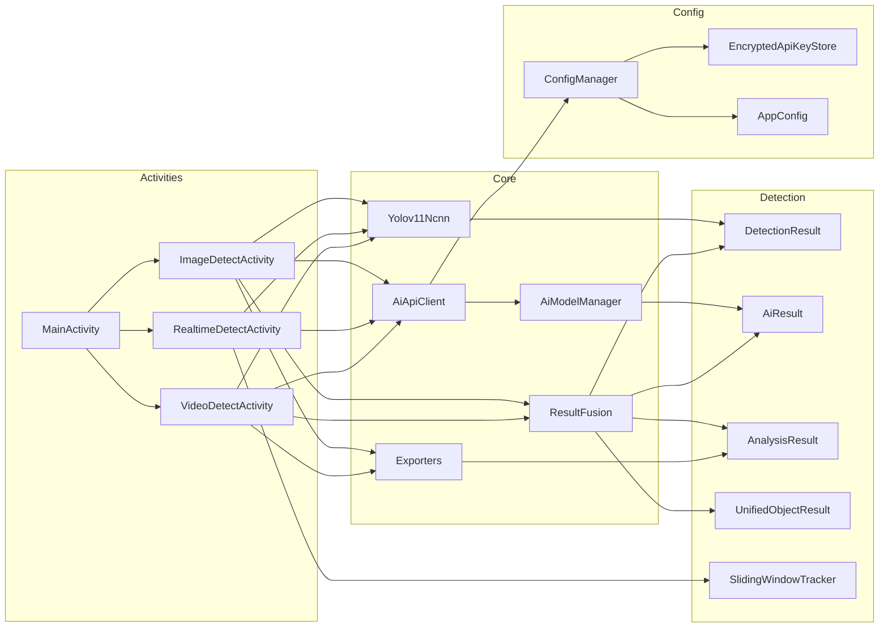

---

*本文档基于 OpenIris v0.4-Alpha 源码分析自动生成。*
