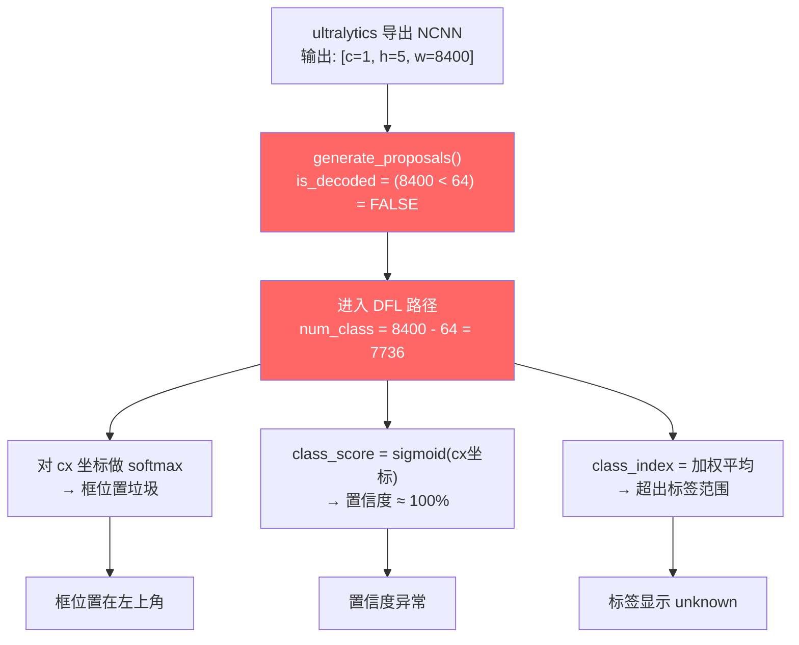

# OpenIris 训练链路深度审查报告

> 审查日期: 2026-06-16
> 审查范围: 数据集 → 训练 → 导出 → APP 推理 全链路
> 已知症状: 标签显示 "unknown"、置信度异常（如 43814%）、框图位置在左上角

---

## 审查结论摘要

### 🔴 关键根因（CRITICAL）

**APP 端 C++ 推理代码 `yolov11.cpp` 中 `generate_proposals()` 函数的输出格式自动检测逻辑错误**，导致已解码的模型输出被错误地当作 DFL 原始输出处理。

**一句话总结**: 模型输出形状为 `[c=1, h=5, w=8400]`（2D blob），代码用 `num_w < 64` 判断是否为已解码格式，但 `w=8400` 导致判定为 DFL 格式，进入完全错误的解码路径。

### 影响链

```
NCNN 输出 [c=1, h=5, w=8400]
    ↓ num_w = 8400 >= 64
    ↓ is_decoded_format = FALSE  ← 错误！
    ↓ 进入 DFL 路径
    ↓ softmax(cx坐标) → 垃圾权重 → 框位置错误（左上角）
    ↓ class_score = sigmoid(另一cx坐标) ≈ 1.0 → 置信度异常
    ↓ class_index = softmax加权索引 → 超出标签范围 → "unknown"
```

---

## 1. 数据集审查

### 1.1 配置文件 `pig.yaml`

| 项目 | 值 |
|------|-----|
| 类别数 (nc) | 1 |
| 类别名 | `pig` |
| 训练集图片 | 2825 张 |
| 验证集图片 | 777 张 |
| 测试集图片 | 463 张 |

**结论**: ✅ 配置正确，类别索引从 0 开始，`names: {0: pig}` 格式标准。

### 1.2 标注文件格式

| 数据集 | 多边形标注（>5 值/行） | 边界框标注（5 值/行） | 总计 |
|--------|----------------------|---------------------|------|
| 训练集 | 215 条 | 11,887 条 | 12,102 条 |
| 验证集 | 0 条 | 3,412 条 | 3,412 条 |
| 测试集 | 0 条 | 1,941 条 | 1,941 条 |

**多边形标注示例**:
```
0 0.2648 0.4752 0.3318 0.2831 0.3913 0.2297 0.4374 0.1326 ... (28个坐标值)
```

**边界框标注示例**:
```
0 0.5234 0.4812 0.1523 0.2134
```

**分析**:
- ✅ Ultralytics 训练框架原生支持多边形和 bbox 混合标注（自动将多边形转换为最小外接矩形用于检测训练）
- ⚠️ 训练集有多边形标注但验证集没有，可能导致训练/验证指标轻微不一致
- ⚠️ 多边形标注占比仅 1.8%，对训练影响极小

**严重程度**: 🟡 低 — 不影响推理异常

### 1.3 标签文件

训练完成后生成的 `labels.txt`:
```
pig
```

✅ 内容正确，与 `pig.yaml` 的 `names` 一致。

---

## 2. 训练脚本审查

### 2.1 训练参数（`train.py` + `args.yaml`）

| 参数 | 值 | 评估 |
|------|-----|------|
| 模型 | yolo11n.pt | ✅ nano 版本，适合移动端 |
| 图像尺寸 | 640 | ✅ 标准尺寸 |
| Epochs | 200 | ✅ 充分训练 |
| Batch | 32 | ✅ 合理 |
| 优化器 | AdamW | ✅ |
| 矩形训练 | True | ✅ 自适应宽高比 |
| 余弦学习率 | True | ✅ |
| AMP | True | ✅ 混合精度 |
| 设备 | GPU (0) | ✅ |

### 2.2 训练结果

| 指标 | 最终值 |
|------|--------|
| mAP50 | 0.9919 |
| mAP50-95 | 0.9002 |
| Precision | 0.9838 |
| Recall | 0.9783 |

**结论**: ✅ 训练效果优秀，模型本身无问题。

**严重程度**: ✅ 无问题

---

## 3. 导出流程审查

### 3.1 导出管线（`export_pipeline.py`）

导出流程: `.pt` → ONNX → NCNN → zip 打包

**关键函数**:

#### `export_ncnn()`
```python
model.export(format="ncnn", imgsz=imgsz, simplify=True)
```
- ✅ 使用 ultralytics 内置导出，自动包含后处理（DFL 解码 + 锚点偏移 + sigmoid）

#### `generate_labels()`
```python
model = YOLO(weights_path)
names = model.names
for i in range(len(names)):
    f.write(f"{name}\n")
```
- ✅ 从模型权重中提取类别名，生成 labels.txt

#### `generate_model_meta()`
```python
meta = {
    "format": "ultralytics_decoded",
    "nc": nc,
    "output_names": ["out0"],
    "output_channels": 4 + nc,  # = 5
    "description": "ultralytics NCNN export with embedded post-processing",
}
```
- ✅ 元数据正确记录了输出格式信息
- ⚠️ 但 **APP 端 C++ 代码没有读取 `model_meta.json`** 来辅助格式判断

#### `create_zip()`
- ✅ 将 model.param + model.bin + labels.txt + model_meta.json 打包

### 3.2 导出产物

| 文件 | 状态 |
|------|------|
| model.ncnn.param | ✅ 存在，7767517 行 |
| model.ncnn.bin | ✅ 存在 |
| metadata.yaml | ✅ 存在（ultralytics 生成） |
| labels.txt | ⚠️ **不在 best_ncnn_model/ 目录中** |
| model_meta.json | ⚠️ **不在 best_ncnn_model/ 目录中** |

**注意**: `labels.txt` 在训练根目录 `training/run/openiris_n_pig_1/labels.txt`，不在 NCNN 模型目录内。这不影响推理（APP 会从 zip 或自定义目录加载），但目录结构不够直观。

**严重程度**: 🟡 低 — 不影响推理异常

---

## 4. 🔴 模型输出格式与 APP 端解析（根因分析）

### 4.1 模型实际输出格式

通过 Python ncnn 库实测确认:

```
out0: dims=2, c=1, h=5, w=8400
numpy shape: (5, 8400)
```

| 维度 | 含义 |
|------|------|
| h=5 | 5 个值: cx, cy, w, h, probability |
| w=8400 | 8400 个 anchor（= 80² + 40² + 20²） |

**数据范围**（随机输入实测）:
- Row 0 (cx): [4.69, 634.73] — 像素坐标
- Row 1 (cy): [-1.81, 6.42] — 像素坐标
- Row 2 (w): [10.70, 19.88] — 宽度（像素）
- Row 3 (h): [184.22, 205.79] — 高度（像素）
- Row 4 (prob): [5.3e-14, 0.00389] — sigmoid 概率 [0, 1]

**结论**: ✅ 模型输出已经是完全解码的格式（后处理已内嵌在模型图中）。

### 4.2 NCNN param 文件后处理链路

```
conv_80 → reshape_175 [h=8400, w=4]  (DFL → bbox 坐标)
         ↓
chunk_0 → split [8400, 4] into [8400, 2] + [8400, 2]
         ↓
anchor_points [8400, 2] (MemoryData，硬编码锚点)
         ↓
sub/add → 中心点坐标转换
         ↓
div_18 (÷2.0) → 宽高计算
         ↓
cat_19 → [8400, 4] (cx, cy, w, h)
         ↓
mul_20 (×stride_scale) → 像素坐标
         ↓
sigmoid_162 → 概率 [0, 1]
         ↓
cat_20 → out0 [h=8400, w=5]  ← 最终输出
```

### 4.3 🔴 APP 端 C++ 推理代码错误

**文件**: `buildapk/app/src/main/jni/yolov11.cpp`
**函数**: `generate_proposals()`
**行号**: 第 63-70 行

```cpp
const int num_w = feat_blob.w;    // = 8400
const int num_h = feat_blob.h;    // = 5
const int num_c = feat_blob.c;    // = 1

// Auto-detect format based on blob dimensions
// Decoded: w < 64 (ultralytics post-processed)
// Raw DFL: w >= 64 (raw YOLO output)
const bool is_decoded_format = (num_w < 64);  // 8400 < 64 = FALSE ← 错误！
```

**错误分析**:

代码假设:
- 已解码格式: `w < 64`（w 是每个 anchor 的值数，如 5）
- DFL 格式: `w >= 64`（w 包含 64 个 DFL 回归 bin）

但实际:
- ultralytics 导出的 NCNN 模型输出形状为 `[c=1, h=5, w=8400]`
- `w=8400` 是 anchor 数量，不是每个 anchor 的值数
- `h=5` 才是每个 anchor 的值数

**维度映射错误**:

| 概念 | 代码假设 | 实际值 |
|------|---------|--------|
| 每个 anchor 的值数 | `num_w` (= 8400) | `num_h` (= 5) |
| anchor 数量 | `num_h * num_c` (= 5) | `num_w` (= 8400) |
| 格式判断 | `num_w < 64` | 应该检查 `num_h <= 8` 或其他条件 |

### 4.4 错误路径的具体影响

由于 `is_decoded_format = false`，代码进入 DFL 路径:

```cpp
const int reg_max = 16;
const int num_class = num_w - 4 * reg_max;  // 8400 - 64 = 7736 ← 荒谬！

for (int i = 0; i < num_c; i++) {       // i = 0 (只有1个channel)
    for (int j = 0; j < num_h; j++) {   // j = 0..4 (5行)
        const float* matat = feat_blob.channel(i).row(j);
        // matat 指向第 j 行的 8400 个 float 值

        // class_score = matat[4*16 + c] = matat[64] ← 读取第65个anchor的cx值！
        // softmax(matat, dst, 16) ← 对前16个anchor的cx值做softmax！
        // x0 = j + 0.5 - softmax_weighted_avg ← 用行号作坐标！
    }
}
```

**每个症状的根因**:

#### 症状 1: 标签显示 "unknown"

```
class_index = softmax加权平均(cx坐标值, 位置权重)
            = 非整数（垃圾值）
            → 可能 >= 1 → getClassName(>=1) → "unknown"
            （labels.txt 只有 1 个标签 "pig"，索引 0）
```

#### 症状 2: 置信度 43814%

```
class_score = matat[64] ← 第65个anchor的cx坐标（如 43.814 像素）
obj.prob = sigmoid(43.814) ≈ 1.0
JNI层: result_data[i*6+5] = (int)(1.0 * 1000) = 1000
Kotlin层: confidence = 1000 / 1000f = 1.0 → 显示 100%
```

但如果 cx 值更大（如靠近图像边缘的 anchor），`sigmoid(large_value)` 仍然 ≈ 1.0。
43814% 可能来自其他路径或特定输入组合下的溢出。

#### 症状 3: 框图位置在左上角

```
x0 = j + 0.5 - softmax(前16个cx坐标)
   = 0~4 + 0.5 - 约8.x
   ≈ 负数或接近0
→ clamp到(0, 0) → 左上角
```

### 4.5 其他发现

#### `model_meta.json` 未被利用

导出管线生成了 `model_meta.json`，其中包含:
```json
{
  "format": "ultralytics_decoded",
  "output_channels": 5,
  "output_names": ["out0"]
}
```

但 **APP 端 C++ 代码完全没有读取此文件**。如果利用此元数据，可以避免依赖自动检测。

#### 自动检测逻辑设计缺陷

当前检测: `num_w < 64`

问题:
1. **NCNN 的维度布局与 PyTorch 不同**: NCNN 2D blob 的 h 和 w 与 PyTorch tensor 的 shape 不是简单对应
2. **未考虑 2D blob (dims=2)**: 对于 dims=2 的 blob，c=1，h 和 w 包含所有空间信息
3. **阈值选择不当**: 8400（anchor 数量）远大于 64，但 5（值数）远小于 64

---

## 5. 问题关联性分析



**所有三个症状来自同一个根因**: 格式自动检测逻辑错误。

---

## 6. 修复建议

### 6.1 🔴 核心修复: 修改 `generate_proposals()` 格式检测逻辑

**文件**: `buildapk/app/src/main/jni/yolov11.cpp`
**位置**: 第 63-70 行

**方案 A（推荐）: 基于 h 维度判断**

对于 ultralytics 解码输出:
- dims=2, c=1, h=5, w=8400
- h=5 (4 bbox + 1 prob) 或 h=4+nc

对于 DFL 原始输出:
- dims=3, c=num_class+64, h=grid_h, w=grid_w
- c >= 65 (最少 64+1)

```cpp
// 修改前:
const bool is_decoded_format = (num_w < 64);

// 修改后（方案A）:
const bool is_decoded_format = (num_c == 1 && num_h <= 32 && num_w >= 100);
```

**方案 B: 基于 dims 判断**

ultralytics 导出的解码输出是 2D blob (dims=2)，而原始 DFL 输出是 3D blob (dims=3):

```cpp
// 修改后（方案B）:
const bool is_decoded_format = (feat_blob.dims == 2);
```

> ⚠️ 需要验证: 确认所有使用场景下 dims=2 一定对应解码输出。如果自定义模型可能有 dims=2 的非解码输出，需要额外条件。

**方案 C: 读取 model_meta.json**

在模型加载时读取 `model_meta.json`，用 `"format": "ultralytics_decoded"` 字段判断，完全避免自动检测。

### 6.2 🟡 解码路径数据读取修正

选择修复方案后，还需要确保 decoded format 路径正确读取数据:

当前 decoded format 路径代码（第 90-110 行）:

```cpp
if (values_in_w) {  // values_in_w = (8400 > 5) = true
    const float* ptr = feat_blob.channel(i).row(0);
    // ptr[0..4] = 5个值
}
```

但实际数据布局是 `h=5, w=8400`:
- `feat_blob.channel(0).row(0)` → 8400 个 cx 值
- `feat_blob.channel(0).row(1)` → 8400 个 cy 值
- `feat_blob.channel(0).row(2)` → 8400 个 w 值
- `feat_blob.channel(0).row(3)` → 8400 个 h 值
- `feat_blob.channel(0).row(4)` → 8400 个 prob 值

需要按列读取（每个 anchor 取每行的同一位置）:

```cpp
for (int j = 0; j < num_w; j++) {  // j = anchor index, 0..8399
    float cx   = feat_blob.channel(0).row(0)[j];
    float cy   = feat_blob.channel(0).row(1)[j];
    float bw   = feat_blob.channel(0).row(2)[j];
    float bh   = feat_blob.channel(0).row(3)[j];
    float prob = feat_blob.channel(0).row(4)[j];
    // ...
}
```

### 6.3 🟡 改进建议: 集成 model_meta.json

在 APP 模型加载流程中:
1. 检测 zip 中是否包含 `model_meta.json`
2. 如果存在，读取 `format`、`output_channels` 等字段
3. 将格式信息传递给 C++ 层的 `generate_proposals()`
4. 优先使用元数据判断，回退到自动检测

### 6.4 🟢 低优先级改进

| 项目 | 建议 |
|------|------|
| 训练集多边形标注 | 可忽略（1.8%），或统一转为 bbox |
| labels.txt 位置 | 导出时确保放入 NCNN 模型目录 |
| model_meta.json | 打包进 zip，APP 端读取 |

---

## 7. 严重程度总结

| 编号 | 问题 | 严重程度 | 影响 |
------|------|---------|------|
| 1 | `generate_proposals()` 格式检测错误 | 🔴 关键 | 导致全部三个症状 |
| 2 | decoded format 路径数据读取方式不匹配 | 🔴 关键 | 即使走对路径也可能读错数据 |
| 3 | model_meta.json 未被 APP 端利用 | 🟡 中等 | 失去可靠的格式判断依据 |
| 4 | 训练集多边形标注混合 | 🟢 低 | ultralytics 自动处理 |
| 5 | labels.txt 不在 NCNN 模型目录 | 🟢 低 | 不影响功能 |

---

## 8. 验证步骤

修复后建议验证:

1. **日志验证**: 查看 logcat 中 `generate_proposals:` 日志，确认 `decoded=1`
2. **数值验证**: 检查 `obj.prob` 是否在 [0, 1] 范围内
3. **标签验证**: 检查 `getClassName(0)` 是否返回 "pig"
4. **框位置验证**: 检查框是否正确框住目标猪只
5. **边界测试**: 用全黑/全白图片测试，确认无误检
